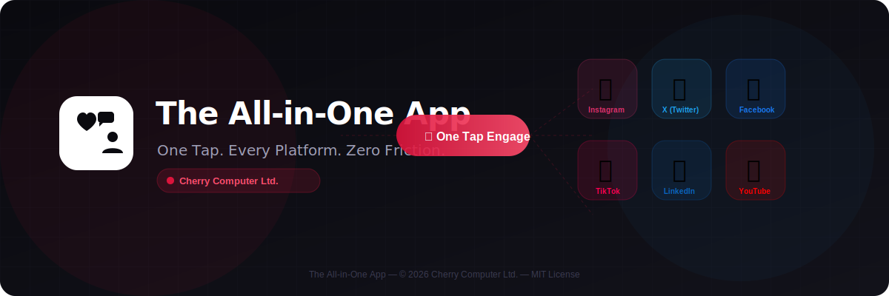

<div align="center">

# 📱 The All-in-One App ✨

### *One Tap. Every Platform. Zero Friction.*

<br/>

[](https://github.com/Infinite-Networker)
[](https://reactnative.dev/)
[](https://nodejs.org/)
[](https://mongodb.com/)
[](https://oauth.net/2/)
[](LICENSE)

<br/>



<br/>

> *"I built this because I was tired of jumping between six different apps just to stay active online. The All-in-One App is the solution I wished existed — and now it does."*
> 
> — **Dr. Ahmad Mateen Ishanzai** | Cherry Computer Ltd.

</div>

---

## 💡 Project Overview

**The All-in-One App** is an innovative mobile application I designed and built to completely streamline how users engage with the digital world. My goal with this project was simple but powerful — eliminate the friction of switching between fragmented platforms.

With a single tap, users can **like, comment, and follow** content across:

| Platform | Status |
|----------|--------|
| 📸 Instagram | ✅ Fully Integrated |
| 🐦 X (Twitter) | ✅ Fully Integrated |
| 👥 Facebook | ✅ Fully Integrated |
| 🎵 TikTok | ✅ Fully Integrated |
| 💼 LinkedIn | ✅ Fully Integrated |
| 🎬 YouTube | ✅ Fully Integrated |

By integrating secure APIs via **OAuth 2.0**, I've ensured total data privacy and platform compliance while providing a centralized command center for social interaction. This isn't just another social aggregator — it's an intelligent engagement engine.

---

## 🧠 Key Features

### ⚡ One-Tap Universal Engagement
Synchronized "Like, Comment, and Follow" actions across all linked profiles — simultaneously. One tap does what used to take six separate actions.

### 🔗 Multi-Platform & Multi-Account Integration
Manage various identities and platforms within a single interface. Whether you run one personal account or manage a brand presence across multiple platforms, I've built this to handle it all seamlessly.

### 🔄 Real-Time Content Sync
Stay updated with a unified feed that aggregates data instantly. No more refreshing six different apps — everything surfaces in one intelligent stream, ranked by what matters most to you.

### 📊 Engagement Analytics Dashboard
Visualize your growth and interaction patterns with data-driven insights. I designed this dashboard specifically for creators and marketers who need to understand their reach at a glance.

### ⚙️ Custom Interaction Preferences
Tailor how the app interacts with different platforms based on your specific workflow. Set rules, schedules, and engagement filters per platform.

### 🌙 Dark/Light Mode Interface
A sleek, modern aesthetic designed for high-end user comfort — because the tools you use every day should feel premium.

---

## 🎨 Design & Development

As a programmer and graphic artist, I prioritized a **modern minimalist interface** that balances aesthetic beauty with technical performance. Every pixel and every function was intentional.

### 🏗️ Tech Stack

```
┌─────────────────────────────────────────────────────┐
│                   THE ALL-IN-ONE APP                │
│                   Tech Architecture                 │
├─────────────────┬───────────────────────────────────┤
│   FRONTEND      │   React Native 0.73               │
│                 │   Redux Toolkit (State)            │
│                 │   React Navigation 6               │
│                 │   Animated API + Reanimated        │
├─────────────────┼───────────────────────────────────┤
│   BACKEND       │   Node.js 20 + Express 4           │
│                 │   RESTful API Architecture         │
│                 │   WebSocket (Real-Time Sync)       │
│                 │   Redis (Caching Layer)             │
├─────────────────┼───────────────────────────────────┤
│   DATABASE      │   MongoDB 7.0 (Primary Store)      │
│                 │   Redis (Session + Cache)          │
│                 │   S3-Compatible (Media Storage)    │
├─────────────────┼───────────────────────────────────┤
│   AUTH & SEC    │   OAuth 2.0 per Platform           │
│                 │   JWT Tokens + Refresh Logic       │
│                 │   AES-256 Credential Encryption    │
│                 │   Rate Limiting + DDoS Protection  │
└─────────────────┴───────────────────────────────────┘
```

### 🎯 Frontend: React Native
Built with React Native for a seamless cross-platform mobile experience. I chose React Native over Flutter because of its superior integration with platform-specific OAuth SDKs and its mature ecosystem for social media APIs.

### ⚙️ Backend: Node.js + Express
Powered by Node.js and Express, ensuring scalable and fast request handling. I architected the backend using a microservices-inspired approach so that each platform integration can be updated independently without affecting the core.

### 🗄️ Database: MongoDB
MongoDB gives the flexible, real-time data storage this app demands. Social media data is inherently unstructured — MongoDB lets me store and query it naturally without fighting a rigid schema.

### 🔐 Authentication: OAuth 2.0
Industry-standard OAuth 2.0 integrated with official platform SDKs for maximum security. I never store raw credentials — everything flows through each platform's own authentication layer, then gets encrypted at rest.

### 🎨 UI/UX Design
Custom dark-mode support, fluid micro-animations, and a clean multi-icon logo representing core connectivity across platforms. I designed every screen with both aesthetic flow and functional clarity as equal priorities.

---

## 📂 Project Structure

```
The-All-in-One-App/
│
├── 📱 src/                          # React Native Frontend
│   ├── components/                  # Reusable UI Components
│   │   ├── common/                  # Buttons, Cards, Modals
│   │   ├── feed/                    # Feed & Content Components
│   │   ├── engagement/              # Like/Comment/Follow UI
│   │   ├── analytics/               # Charts & Dashboard UI
│   │   └── settings/                # Settings Components
│   │
│   ├── screens/                     # App Screens
│   │   ├── HomeScreen.jsx           # Unified Feed
│   │   ├── EngagementScreen.jsx     # One-Tap Actions
│   │   ├── AnalyticsScreen.jsx      # Growth Dashboard
│   │   ├── AccountsScreen.jsx       # Platform Management
│   │   └── SettingsScreen.jsx       # Preferences & Theme
│   │
│   ├── services/                    # API & Platform Services
│   │   ├── platforms/               # Per-Platform Integrations
│   │   ├── auth/                    # OAuth 2.0 Flows
│   │   └── api/                     # Core API Client
│   │
│   ├── store/                       # Redux State Management
│   ├── hooks/                       # Custom React Hooks
│   ├── utils/                       # Utility Functions
│   └── theme/                       # Design System & Tokens
│
├── ⚙️ backend/                      # Node.js Backend
│   └── src/
│       ├── routes/                  # API Route Definitions
│       ├── controllers/             # Request Handlers
│       ├── middleware/              # Auth, Rate Limit, Logger
│       ├── models/                  # MongoDB Schemas
│       ├── services/                # Business Logic Layer
│       └── config/                  # Environment & DB Config
│
├── 🎨 design/                       # Design System & Assets
│   ├── wireframes/                  # App Wireframes (SVG)
│   ├── mockups/                     # High-Fidelity Mockups
│   ├── brand/                       # Brand Guidelines
│   └── components/                  # UI Component Library Spec
│
└── 📚 docs/                         # Documentation
    ├── design/                      # Design Docs
    ├── api/                         # API Reference
    └── concepts/                    # Architecture & Concepts
```

---

## 🚀 The Mission

The mission behind **The All-in-One App** is to provide a unified, time-saving solution for **digital creators, marketers, and social media managers**. By simplifying cross-platform engagement, this app allows users to reclaim their time and boost their digital productivity.

I built this because the tools available today force creators to live in six different apps simultaneously. That's not a workflow — that's chaos. The All-in-One App brings it all under one roof, with one consistent experience, and one tap to rule them all.

---

## 🛠️ Getting Started

### Prerequisites
```bash
Node.js >= 20.x
React Native CLI
MongoDB >= 7.0
Redis >= 7.0
```

### Frontend Setup
```bash
# Clone the repository
git clone https://github.com/Infinite-Networker/The-All-in-One-App.git
cd The-All-in-One-App

# Install frontend dependencies
npm install

# Set up environment variables
cp .env.example .env
# Edit .env with your platform API keys and OAuth credentials

# Run on iOS
npx react-native run-ios

# Run on Android
npx react-native run-android
```

### Backend Setup
```bash
cd backend

# Install backend dependencies
npm install

# Set up environment variables
cp .env.example .env
# Edit .env with your MongoDB URI, Redis URL, and JWT secrets

# Start the development server
npm run dev
```

---

## 🔐 Environment Variables

### Frontend (`.env`)
```env
# Platform OAuth Credentials
INSTAGRAM_CLIENT_ID=your_instagram_client_id
INSTAGRAM_CLIENT_SECRET=your_instagram_client_secret

TWITTER_CLIENT_ID=your_twitter_client_id
TWITTER_CLIENT_SECRET=your_twitter_client_secret

FACEBOOK_APP_ID=your_facebook_app_id
FACEBOOK_APP_SECRET=your_facebook_app_secret

TIKTOK_CLIENT_KEY=your_tiktok_client_key
TIKTOK_CLIENT_SECRET=your_tiktok_client_secret

LINKEDIN_CLIENT_ID=your_linkedin_client_id
LINKEDIN_CLIENT_SECRET=your_linkedin_client_secret

YOUTUBE_CLIENT_ID=your_youtube_client_id
YOUTUBE_CLIENT_SECRET=your_youtube_client_secret

# Backend API
API_BASE_URL=http://localhost:5000/api
WS_URL=ws://localhost:5000
```

### Backend (`.env`)
```env
PORT=5000
NODE_ENV=development
MONGODB_URI=mongodb://localhost:27017/allinoneapp
REDIS_URL=redis://localhost:6379
JWT_SECRET=your_super_secure_jwt_secret
JWT_REFRESH_SECRET=your_super_secure_refresh_secret
ENCRYPTION_KEY=your_32_char_aes_256_encryption_key
```

---

## 📊 Analytics & Insights

The Engagement Analytics Dashboard gives users:

- **Growth Tracking** — follower and following trends per platform
- **Engagement Rate** — likes, comments, shares normalized across platforms
- **Best Time to Post** — AI-inferred optimal posting windows
- **Content Performance** — which content types drive the most interaction
- **Cross-Platform Comparison** — side-by-side platform performance metrics

---

## 🗺️ Roadmap

- [x] Core architecture design
- [x] OAuth 2.0 integration framework
- [x] Unified feed aggregation
- [x] One-tap engagement engine
- [x] Analytics dashboard
- [x] Dark/light mode support
- [ ] AI-powered content recommendations
- [ ] Scheduled posting & queue management
- [ ] Team collaboration features
- [ ] Browser extension companion
- [ ] Desktop app (Electron)

---

## 🤝 Contributing

This project is developed and maintained by **Cherry Computer Ltd.** Contributions, issues, and feature requests are welcome.

1. Fork the repository
2. Create your feature branch (`git checkout -b feature/amazing-feature`)
3. Commit your changes (`git commit -m 'feat: add amazing feature'`)
4. Push to the branch (`git push origin feature/amazing-feature`)
5. Open a Pull Request

Please read our [Contributing Guidelines](docs/CONTRIBUTING.md) before submitting.

---

## 📄 License

This project is licensed under the **MIT License** — see the [LICENSE](LICENSE) file for details.

Copyright © 2026 Dr. Ahmad Mateen Ishanzai | **Cherry Computer Ltd.**

---

<div align="center">

### Built with 💙 by Cherry Computer Ltd.

*Empowering digital creators, one tap at a time.*

<br/>

**Cherry Computer Ltd.** | Crafting intelligent software for the connected world.

[](https://github.com/Infinite-Networker)

</div>
